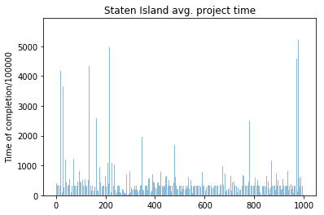
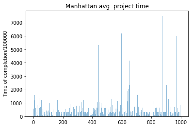
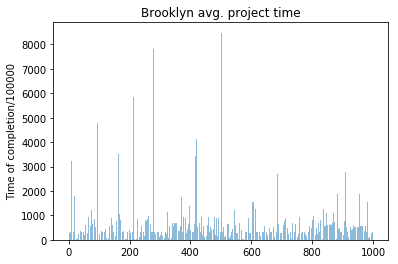
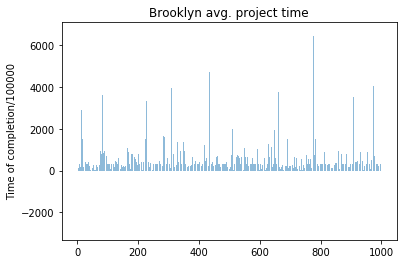
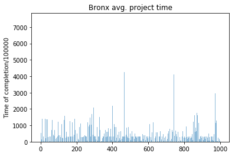

```python
#imports
import pandas as pd
from datetime import datetime
import matplotlib.pyplot as plt
import numpy as np
```


```python
#convert to pandas dataframe for ease of access
f = pd.read_csv("C:\\Users\\aashi\\Desktop\Topos\DOB_Permit_Issuance.csv",header='infer')
df = pd.DataFrame(f)
print(df.columns)
#df.head()
```

    C:\Users\aashi\Anaconda3\lib\site-packages\IPython\core\interactiveshell.py:2698: DtypeWarning: Columns (1,8,9,10,15,25,31,33,34,35,36,51,52) have mixed types. Specify dtype option on import or set low_memory=False.
      interactivity=interactivity, compiler=compiler, result=result)
    

    Index(['BOROUGH', 'Bin #', 'House #', 'Street Name', 'Job #', 'Job doc. #',
           'Job Type', 'Self_Cert', 'Block', 'Lot', 'Community Board', 'Zip Code',
           'Bldg Type', 'Residential', 'Special District 1', 'Special District 2',
           'Work Type', 'Permit Status', 'Filing Status', 'Permit Type',
           'Permit Sequence #', 'Permit Subtype', 'Oil Gas', 'Site Fill',
           'Filing Date', 'Issuance Date', 'Expiration Date', 'Job Start Date',
           'Permittee's First Name', 'Permittee's Last Name',
           'Permittee's Business Name', 'Permittee's Phone #',
           'Permittee's License Type', 'Permittee's License #',
           'Act as Superintendent', 'Permittee's Other Title', 'HIC License',
           'Site Safety Mgr's First Name', 'Site Safety Mgr's Last Name',
           'Site Safety Mgr Business Name', 'Superintendent First & Last Name',
           'Superintendent Business Name', 'Owner's Business Type', 'Non-Profit',
           'Owner's Business Name', 'Owner's First Name', 'Owner's Last Name',
           'Owner's House #', 'Owner's House Street Name', 'Owner’s House City',
           'Owner’s House State', 'Owner’s House Zip Code', 'Owner's Phone #',
           'DOBRunDate', 'PERMIT_SI_NO', 'LATITUDE', 'LONGITUDE',
           'COUNCIL_DISTRICT', 'CENSUS_TRACT', 'NTA_NAME'],
          dtype='object')
    


```python
# total number of permits per borough
man_permits = 1462213
brk_permits = 813934
brx_permits = 296495
si_permits = 204365
qns_permits = 731242
```


```python
# get the rates of DM/NB/A1 in Manhattan
df2 = df[['BOROUGH','Job Type']]
df2_man = df2[df2['BOROUGH'] == "MANHATTAN"]
df2_man_1 = df2_man[df2_man['Job Type'] == "NB"]
df2_man_2 = df2_man[df2_man['Job Type'] == "DM"]
df2_man_3 = df2_man[df2_man['Job Type'] == "A1"]
total_df_man = df2_man_1['BOROUGH'].count() + df2_man_2['BOROUGH'].count() + df2_man_3['BOROUGH'].count()
#this looks redundant but there was some error in writing the code as df2['Job Type'] == "NB" or "DM".
man_per = (total_df_man/man_permits) * 100
print(man_per)
```

    8.103675729869725
    


```python
# get the rates of DM/NB/A1 in Brooklyn
df2 = df[['BOROUGH','Job Type']]
df2_brk = df2[df2['BOROUGH'] == "BROOKLYN"]
df2_brk_1 = df2_brk[df2_brk['Job Type'] == "NB"]
df2_brk_2 = df2_brk[df2_brk['Job Type'] == "DM"]
df2_brk_3 = df2_brk[df2_brk['Job Type'] == "A1"]
total_df_brk = df2_brk_1['BOROUGH'].count() + df2_brk_2['BOROUGH'].count() + df2_brk_3['BOROUGH'].count()
#this looks redundant but there was some error in writing the code as df2['Job Type'] == "NB" or "DM" or "A1".
brk_per = (total_df_brk/brk_permits) * 100
print(brk_per)
```

    36.25809955106925
    


```python
# get the rates of DM/NB/A1 in Bronx
df2 = df[['BOROUGH','Job Type']]
df2_brx = df2[df2['BOROUGH'] == "BRONX"]
df2_brx_1 = df2_brx[df2_brx['Job Type'] == "NB"]
df2_brx_2 = df2_brx[df2_brx['Job Type'] == "DM"]
df2_brx_3 = df2_brx[df2_brx['Job Type'] == "A1"]
total_df_brx = df2_brx_1['BOROUGH'].count() + df2_brx_2['BOROUGH'].count() + df2_brx_3['BOROUGH'].count()
#this looks redundant but there was some error in writing the code as df2['Job Type'] == "NB" or "DM" or "A1".
brx_per = (total_df_brx/brx_permits) * 100
print(brx_per)
```

    33.26126916136866
    


```python
# get the rates of DM/NB/A1 in Queens
df2 = df[['BOROUGH','Job Type']]
df2_qns = df2[df2['BOROUGH'] == "QUEENS"]
df2_qns_1 = df2_qns[df2_qns['Job Type'] == "NB"]
df2_qns_2 = df2_qns[df2_qns['Job Type'] == "DM"]
df2_qns_3 = df2_qns[df2_qns['Job Type'] == "A1"]
total_df_qns = df2_qns_1['BOROUGH'].count() + df2_qns_2['BOROUGH'].count() + df2_qns_3['BOROUGH'].count()
#this looks redundant but there was some error in writing the code as df2['Job Type'] == "NB" or "DM" or "A1".
qns_per = (total_df_qns/qns_permits) * 100
print(qns_per)
```

    42.913016484282906
    


```python
# get the rates of DM/NB/A1 in Staten Island
df2 = df[['BOROUGH','Job Type']]
df2_si = df2[df2['BOROUGH'] == "STATEN ISLAND"]
df2_si_1 = df2_si[df2_si['Job Type'] == "NB"]
df2_si_2 = df2_si[df2_si['Job Type'] == "DM"]
df2_si_3 = df2_si[df2_si['Job Type'] == "A1"]
total_df_si = df2_si_1['BOROUGH'].count() + df2_si_2['BOROUGH'].count() + df2_si_3['BOROUGH'].count()
#this looks redundant but there was some error in writing the code as df2['Job Type'] == "NB" or "DM" or "A1".
si_per = (total_df_si/si_permits) * 100
print(si_per)
```

    62.265064957306784
    


```python
#Final Rates
"""
Manhattan - 8.10%
Bronx - 33.26%
Brooklyn - 36.25%
Queens - 42.91%
Staten Island - 62.265%
"""
```


    '\nManhattan - 8.10%\nBronx - 33.26%\nBrooklyn - 36.25%\nQueens - 42.91%\nStaten Island - 62.265%\n'


```python
# Now for the time of job completion, we first remove all null values
df3 = df[['BOROUGH','Job Type','Expiration Date', 'Job Start Date']]
df3[df3['Job Start Date'].isnull()] # as we can see there are some nulls
```


<div>
<style>
    .dataframe thead tr:only-child th {
        text-align: right;
    }

    .dataframe thead th {
        text-align: left;
    }

    .dataframe tbody tr th {
        vertical-align: top;
    }
</style>
<table border="1" class="dataframe">
  <thead>
    <tr style="text-align: right;">
      <th></th>
      <th>BOROUGH</th>
      <th>Job Type</th>
      <th>Expiration Date</th>
      <th>Job Start Date</th>
    </tr>
  </thead>
  <tbody>
    <tr>
      <th>202809</th>
      <td>MANHATTAN</td>
      <td>NB</td>
      <td>02/23/2018 12:00:00 AM</td>
      <td>NaN</td>
    </tr>
    <tr>
      <th>359425</th>
      <td>MANHATTAN</td>
      <td>NB</td>
      <td>02/23/2018 12:00:00 AM</td>
      <td>NaN</td>
    </tr>
    <tr>
      <th>562732</th>
      <td>MANHATTAN</td>
      <td>NB</td>
      <td>02/23/2017 12:00:00 AM</td>
      <td>NaN</td>
    </tr>
    <tr>
      <th>751041</th>
      <td>MANHATTAN</td>
      <td>NB</td>
      <td>02/23/2016 12:00:00 AM</td>
      <td>NaN</td>
    </tr>
    <tr>
      <th>761245</th>
      <td>MANHATTAN</td>
      <td>NB</td>
      <td>02/26/2015 12:00:00 AM</td>
      <td>NaN</td>
    </tr>
    <tr>
      <th>1349375</th>
      <td>MANHATTAN</td>
      <td>A2</td>
      <td>05/11/2012 12:00:00 AM</td>
      <td>NaN</td>
    </tr>
    <tr>
      <th>1418188</th>
      <td>MANHATTAN</td>
      <td>A2</td>
      <td>10/31/2011 12:00:00 AM</td>
      <td>NaN</td>
    </tr>
    <tr>
      <th>1451237</th>
      <td>MANHATTAN</td>
      <td>A2</td>
      <td>08/15/2011 12:00:00 AM</td>
      <td>NaN</td>
    </tr>
    <tr>
      <th>1554567</th>
      <td>MANHATTAN</td>
      <td>A2</td>
      <td>10/31/2010 12:00:00 AM</td>
      <td>NaN</td>
    </tr>
    <tr>
      <th>1592608</th>
      <td>MANHATTAN</td>
      <td>A2</td>
      <td>03/12/2011 12:00:00 AM</td>
      <td>NaN</td>
    </tr>
    <tr>
      <th>1721899</th>
      <td>MANHATTAN</td>
      <td>A2</td>
      <td>08/15/2010 12:00:00 AM</td>
      <td>NaN</td>
    </tr>
    <tr>
      <th>1816553</th>
      <td>MANHATTAN</td>
      <td>DM</td>
      <td>01/01/2009 12:00:00 AM</td>
      <td>NaN</td>
    </tr>
    <tr>
      <th>1849396</th>
      <td>BRONX</td>
      <td>NB</td>
      <td>12/31/2007 12:00:00 AM</td>
      <td>NaN</td>
    </tr>
    <tr>
      <th>2238650</th>
      <td>MANHATTAN</td>
      <td>A3</td>
      <td>05/01/2006 12:00:00 AM</td>
      <td>NaN</td>
    </tr>
    <tr>
      <th>2247521</th>
      <td>MANHATTAN</td>
      <td>A3</td>
      <td>12/31/2006 12:00:00 AM</td>
      <td>NaN</td>
    </tr>
    <tr>
      <th>2396085</th>
      <td>MANHATTAN</td>
      <td>A3</td>
      <td>04/01/2005 12:00:00 AM</td>
      <td>NaN</td>
    </tr>
    <tr>
      <th>2415591</th>
      <td>BRONX</td>
      <td>A3</td>
      <td>07/01/2004 12:00:00 AM</td>
      <td>NaN</td>
    </tr>
    <tr>
      <th>2506231</th>
      <td>MANHATTAN</td>
      <td>A2</td>
      <td>04/01/2004 12:00:00 AM</td>
      <td>NaN</td>
    </tr>
    <tr>
      <th>2512854</th>
      <td>MANHATTAN</td>
      <td>A2</td>
      <td>06/18/2004 12:00:00 AM</td>
      <td>NaN</td>
    </tr>
    <tr>
      <th>2514561</th>
      <td>MANHATTAN</td>
      <td>A3</td>
      <td>04/01/2004 12:00:00 AM</td>
      <td>NaN</td>
    </tr>
    <tr>
      <th>2522984</th>
      <td>MANHATTAN</td>
      <td>A3</td>
      <td>04/01/2004 12:00:00 AM</td>
      <td>NaN</td>
    </tr>
    <tr>
      <th>2546894</th>
      <td>BRONX</td>
      <td>A3</td>
      <td>12/31/2003 12:00:00 AM</td>
      <td>NaN</td>
    </tr>
    <tr>
      <th>2832730</th>
      <td>MANHATTAN</td>
      <td>A3</td>
      <td>12/31/2000 12:00:00 AM</td>
      <td>NaN</td>
    </tr>
    <tr>
      <th>2858502</th>
      <td>QUEENS</td>
      <td>A3</td>
      <td>12/01/2000 12:00:00 AM</td>
      <td>NaN</td>
    </tr>
    <tr>
      <th>2871270</th>
      <td>MANHATTAN</td>
      <td>A3</td>
      <td>12/01/2000 12:00:00 AM</td>
      <td>NaN</td>
    </tr>
    <tr>
      <th>2890567</th>
      <td>BRONX</td>
      <td>SG</td>
      <td>06/30/2000 12:00:00 AM</td>
      <td>NaN</td>
    </tr>
    <tr>
      <th>3071883</th>
      <td>BRONX</td>
      <td>A1</td>
      <td>04/02/1998 12:00:00 AM</td>
      <td>NaN</td>
    </tr>
    <tr>
      <th>3072832</th>
      <td>BRONX</td>
      <td>A2</td>
      <td>03/20/1998 12:00:00 AM</td>
      <td>NaN</td>
    </tr>
    <tr>
      <th>3495736</th>
      <td>BRONX</td>
      <td>A1</td>
      <td>04/02/1998 12:00:00 AM</td>
      <td>NaN</td>
    </tr>
    <tr>
      <th>3500489</th>
      <td>QUEENS</td>
      <td>A2</td>
      <td>NaN</td>
      <td>NaN</td>
    </tr>
  </tbody>
</table>
</div>


```python
#drop NaN values to get an even table
df4 = df3.dropna()
df4.isnull().any(1)
#p = datetime.fromtimestamp(1138078800).strftime('%m/%d/%Y %I:%M:%S %p')
#print(p)
#df4.set_value(2135864,'Job Start Date',p)
#df4.at['Job Start Date',2135864] = p
df4 = df4.drop(df4.index[2135864:2135865]) #remaining anomalous value
df4 = df4.drop(df4.index[2914915:2914916])
df5 = df4.drop(df4.index[3038818:3038819])
df5.count()
```


    BOROUGH            3497074
    Job Type           3497074
    Expiration Date    3497074
    Job Start Date     3497074
    dtype: int64


```python
#finding the differences from the date of issuance to the job start
comp_time = []
comp_time_readable = []
def convertMillis(millis):
    millis = int(millis)
    #minutes=round((millis/(1000*60))%60)
    #minutes = int(minutes)
    hours=round((millis/(1000*60*60))%24)
    days = round((millis/86400))
    return str(days)+" days, "+str(hours)+" hours"
    
    
for x,y in zip(df5['Expiration Date'],df5['Job Start Date']):
    datetime_object1 = datetime.strptime(x, '%m/%d/%Y %I:%M:%S %p').timestamp()
    datetime_object2 = datetime.strptime(y, '%m/%d/%Y %I:%M:%S %p').timestamp()
    time = (datetime_object1 - datetime_object2)
    comp_time.append(time)
    z = convertMillis(time)
    comp_time_readable.append(z)
    
print("OK")
```

    OK
    


```python
print(len(comp_time),len(comp_time_readable))
df5['Project Completion'] = comp_time
df5['Project Completion(r)'] = comp_time_readable
df5.head(200)
```

    3497074 3497074
    


<div>
<style>
    .dataframe thead tr:only-child th {
        text-align: right;
    }

    .dataframe thead th {
        text-align: left;
    }

    .dataframe tbody tr th {
        vertical-align: top;
    }
</style>
<table border="1" class="dataframe">
  <thead>
    <tr style="text-align: right;">
      <th></th>
      <th>BOROUGH</th>
      <th>Job Type</th>
      <th>Expiration Date</th>
      <th>Job Start Date</th>
      <th>Project Completion</th>
      <th>Project Completion(r)</th>
    </tr>
  </thead>
  <tbody>
    <tr>
      <th>0</th>
      <td>BRONX</td>
      <td>A2</td>
      <td>03/25/2020 12:00:00 AM</td>
      <td>03/26/2019 12:00:00 AM</td>
      <td>31536000.0</td>
      <td>365 days, 9 hours</td>
    </tr>
    <tr>
      <th>1</th>
      <td>MANHATTAN</td>
      <td>A3</td>
      <td>03/25/2020 12:00:00 AM</td>
      <td>03/26/2019 12:00:00 AM</td>
      <td>31536000.0</td>
      <td>365 days, 9 hours</td>
    </tr>
    <tr>
      <th>2</th>
      <td>MANHATTAN</td>
      <td>A2</td>
      <td>07/18/2019 12:00:00 AM</td>
      <td>03/26/2019 12:00:00 AM</td>
      <td>9849600.0</td>
      <td>114 days, 3 hours</td>
    </tr>
    <tr>
      <th>3</th>
      <td>QUEENS</td>
      <td>A2</td>
      <td>09/15/2019 12:00:00 AM</td>
      <td>07/20/2018 12:00:00 AM</td>
      <td>36460800.0</td>
      <td>422 days, 10 hours</td>
    </tr>
    <tr>
      <th>4</th>
      <td>QUEENS</td>
      <td>A1</td>
      <td>03/25/2020 12:00:00 AM</td>
      <td>02/21/2017 12:00:00 AM</td>
      <td>97455600.0</td>
      <td>1128 days, 3 hours</td>
    </tr>
    <tr>
      <th>5</th>
      <td>BRONX</td>
      <td>A2</td>
      <td>03/25/2020 12:00:00 AM</td>
      <td>03/26/2019 12:00:00 AM</td>
      <td>31536000.0</td>
      <td>365 days, 9 hours</td>
    </tr>
    <tr>
      <th>6</th>
      <td>QUEENS</td>
      <td>A2</td>
      <td>02/16/2020 12:00:00 AM</td>
      <td>09/14/2018 12:00:00 AM</td>
      <td>44931600.0</td>
      <td>520 days, 12 hours</td>
    </tr>
    <tr>
      <th>7</th>
      <td>MANHATTAN</td>
      <td>A2</td>
      <td>03/25/2020 12:00:00 AM</td>
      <td>03/26/2019 12:00:00 AM</td>
      <td>31536000.0</td>
      <td>365 days, 9 hours</td>
    </tr>
    <tr>
      <th>8</th>
      <td>QUEENS</td>
      <td>NB</td>
      <td>04/01/2020 12:00:00 AM</td>
      <td>08/15/2017 12:00:00 AM</td>
      <td>82944000.0</td>
      <td>960 days, 23 hours</td>
    </tr>
    <tr>
      <th>9</th>
      <td>BROOKLYN</td>
      <td>A2</td>
      <td>03/15/2020 12:00:00 AM</td>
      <td>03/26/2019 12:00:00 AM</td>
      <td>30672000.0</td>
      <td>355 days, 9 hours</td>
    </tr>
    <tr>
      <th>10</th>
      <td>STATEN ISLAND</td>
      <td>A2</td>
      <td>09/15/2019 12:00:00 AM</td>
      <td>12/04/2017 12:00:00 AM</td>
      <td>56156400.0</td>
      <td>650 days, 16 hours</td>
    </tr>
    <tr>
      <th>11</th>
      <td>QUEENS</td>
      <td>A2</td>
      <td>10/01/2019 12:00:00 AM</td>
      <td>03/26/2019 12:00:00 AM</td>
      <td>16329600.0</td>
      <td>189 days, 5 hours</td>
    </tr>
    <tr>
      <th>12</th>
      <td>MANHATTAN</td>
      <td>A2</td>
      <td>03/21/2020 12:00:00 AM</td>
      <td>06/04/2018 12:00:00 AM</td>
      <td>56678400.0</td>
      <td>656 days, 16 hours</td>
    </tr>
    <tr>
      <th>13</th>
      <td>BROOKLYN</td>
      <td>A2</td>
      <td>03/25/2020 12:00:00 AM</td>
      <td>03/26/2019 12:00:00 AM</td>
      <td>31536000.0</td>
      <td>365 days, 9 hours</td>
    </tr>
    <tr>
      <th>14</th>
      <td>MANHATTAN</td>
      <td>A2</td>
      <td>03/25/2020 12:00:00 AM</td>
      <td>09/07/2017 12:00:00 AM</td>
      <td>80352000.0</td>
      <td>930 days, 22 hours</td>
    </tr>
    <tr>
      <th>15</th>
      <td>BROOKLYN</td>
      <td>A2</td>
      <td>03/25/2020 12:00:00 AM</td>
      <td>03/26/2019 12:00:00 AM</td>
      <td>31536000.0</td>
      <td>365 days, 9 hours</td>
    </tr>
    <tr>
      <th>16</th>
      <td>BROOKLYN</td>
      <td>NB</td>
      <td>02/19/2020 12:00:00 AM</td>
      <td>03/26/2019 12:00:00 AM</td>
      <td>28515600.0</td>
      <td>330 days, 8 hours</td>
    </tr>
    <tr>
      <th>17</th>
      <td>BROOKLYN</td>
      <td>A2</td>
      <td>03/21/2020 12:00:00 AM</td>
      <td>06/19/2018 12:00:00 AM</td>
      <td>55382400.0</td>
      <td>641 days, 15 hours</td>
    </tr>
    <tr>
      <th>18</th>
      <td>MANHATTAN</td>
      <td>A2</td>
      <td>08/26/2019 12:00:00 AM</td>
      <td>03/26/2019 12:00:00 AM</td>
      <td>13219200.0</td>
      <td>153 days, 4 hours</td>
    </tr>
    <tr>
      <th>19</th>
      <td>BROOKLYN</td>
      <td>A2</td>
      <td>03/25/2020 12:00:00 AM</td>
      <td>03/26/2019 12:00:00 AM</td>
      <td>31536000.0</td>
      <td>365 days, 9 hours</td>
    </tr>
    <tr>
      <th>20</th>
      <td>BROOKLYN</td>
      <td>A3</td>
      <td>03/25/2020 12:00:00 AM</td>
      <td>03/26/2019 12:00:00 AM</td>
      <td>31536000.0</td>
      <td>365 days, 9 hours</td>
    </tr>
    <tr>
      <th>21</th>
      <td>MANHATTAN</td>
      <td>A2</td>
      <td>03/25/2020 12:00:00 AM</td>
      <td>06/03/2016 12:00:00 AM</td>
      <td>120182400.0</td>
      <td>1391 days, 9 hours</td>
    </tr>
    <tr>
      <th>22</th>
      <td>MANHATTAN</td>
      <td>A1</td>
      <td>03/23/2020 12:00:00 AM</td>
      <td>10/18/2017 12:00:00 AM</td>
      <td>76636800.0</td>
      <td>887 days, 21 hours</td>
    </tr>
    <tr>
      <th>23</th>
      <td>MANHATTAN</td>
      <td>A2</td>
      <td>03/25/2020 12:00:00 AM</td>
      <td>04/17/2018 12:00:00 AM</td>
      <td>61171200.0</td>
      <td>708 days, 17 hours</td>
    </tr>
    <tr>
      <th>24</th>
      <td>QUEENS</td>
      <td>A3</td>
      <td>08/27/2019 12:00:00 AM</td>
      <td>03/26/2019 12:00:00 AM</td>
      <td>13305600.0</td>
      <td>154 days, 4 hours</td>
    </tr>
    <tr>
      <th>25</th>
      <td>MANHATTAN</td>
      <td>A3</td>
      <td>03/25/2020 12:00:00 AM</td>
      <td>03/24/2015 12:00:00 AM</td>
      <td>157939200.0</td>
      <td>1828 days, 20 hours</td>
    </tr>
    <tr>
      <th>26</th>
      <td>QUEENS</td>
      <td>A1</td>
      <td>03/25/2020 12:00:00 AM</td>
      <td>12/21/2016 12:00:00 AM</td>
      <td>102812400.0</td>
      <td>1190 days, 5 hours</td>
    </tr>
    <tr>
      <th>27</th>
      <td>QUEENS</td>
      <td>NB</td>
      <td>01/23/2020 12:00:00 AM</td>
      <td>12/23/2016 12:00:00 AM</td>
      <td>97286400.0</td>
      <td>1126 days, 3 hours</td>
    </tr>
    <tr>
      <th>28</th>
      <td>MANHATTAN</td>
      <td>A3</td>
      <td>03/25/2020 12:00:00 AM</td>
      <td>04/06/2017 12:00:00 AM</td>
      <td>93657600.0</td>
      <td>1084 days, 2 hours</td>
    </tr>
    <tr>
      <th>29</th>
      <td>QUEENS</td>
      <td>A1</td>
      <td>03/25/2020 12:00:00 AM</td>
      <td>03/26/2019 12:00:00 AM</td>
      <td>31536000.0</td>
      <td>365 days, 9 hours</td>
    </tr>
    <tr>
      <th>...</th>
      <td>...</td>
      <td>...</td>
      <td>...</td>
      <td>...</td>
      <td>...</td>
      <td>...</td>
    </tr>
    <tr>
      <th>170</th>
      <td>BRONX</td>
      <td>A2</td>
      <td>10/24/2019 12:00:00 AM</td>
      <td>03/26/2019 12:00:00 AM</td>
      <td>18316800.0</td>
      <td>212 days, 5 hours</td>
    </tr>
    <tr>
      <th>171</th>
      <td>QUEENS</td>
      <td>A2</td>
      <td>03/25/2020 12:00:00 AM</td>
      <td>10/21/2015 12:00:00 AM</td>
      <td>139708800.0</td>
      <td>1617 days, 15 hours</td>
    </tr>
    <tr>
      <th>172</th>
      <td>QUEENS</td>
      <td>A3</td>
      <td>03/25/2020 12:00:00 AM</td>
      <td>04/21/2017 12:00:00 AM</td>
      <td>92361600.0</td>
      <td>1069 days, 2 hours</td>
    </tr>
    <tr>
      <th>173</th>
      <td>MANHATTAN</td>
      <td>A2</td>
      <td>09/20/2019 12:00:00 AM</td>
      <td>03/26/2019 12:00:00 AM</td>
      <td>15379200.0</td>
      <td>178 days, 4 hours</td>
    </tr>
    <tr>
      <th>174</th>
      <td>QUEENS</td>
      <td>A1</td>
      <td>05/17/2019 12:00:00 AM</td>
      <td>02/23/2018 12:00:00 AM</td>
      <td>38703600.0</td>
      <td>448 days, 11 hours</td>
    </tr>
    <tr>
      <th>175</th>
      <td>QUEENS</td>
      <td>A2</td>
      <td>03/25/2020 12:00:00 AM</td>
      <td>04/27/2015 12:00:00 AM</td>
      <td>155001600.0</td>
      <td>1794 days, 19 hours</td>
    </tr>
    <tr>
      <th>176</th>
      <td>BROOKLYN</td>
      <td>A2</td>
      <td>03/25/2020 12:00:00 AM</td>
      <td>03/26/2019 12:00:00 AM</td>
      <td>31536000.0</td>
      <td>365 days, 9 hours</td>
    </tr>
    <tr>
      <th>177</th>
      <td>MANHATTAN</td>
      <td>A1</td>
      <td>11/19/2019 12:00:00 AM</td>
      <td>04/17/2018 12:00:00 AM</td>
      <td>50202000.0</td>
      <td>581 days, 14 hours</td>
    </tr>
    <tr>
      <th>178</th>
      <td>MANHATTAN</td>
      <td>A2</td>
      <td>03/25/2020 12:00:00 AM</td>
      <td>07/20/2018 12:00:00 AM</td>
      <td>53049600.0</td>
      <td>614 days, 15 hours</td>
    </tr>
    <tr>
      <th>179</th>
      <td>QUEENS</td>
      <td>A2</td>
      <td>03/25/2020 12:00:00 AM</td>
      <td>04/24/2015 12:00:00 AM</td>
      <td>155260800.0</td>
      <td>1797 days, 19 hours</td>
    </tr>
    <tr>
      <th>180</th>
      <td>MANHATTAN</td>
      <td>A2</td>
      <td>05/13/2019 12:00:00 AM</td>
      <td>03/26/2019 12:00:00 AM</td>
      <td>4147200.0</td>
      <td>48 days, 1 hours</td>
    </tr>
    <tr>
      <th>181</th>
      <td>MANHATTAN</td>
      <td>A2</td>
      <td>10/01/2019 12:00:00 AM</td>
      <td>03/26/2019 12:00:00 AM</td>
      <td>16329600.0</td>
      <td>189 days, 5 hours</td>
    </tr>
    <tr>
      <th>182</th>
      <td>BROOKLYN</td>
      <td>A2</td>
      <td>03/25/2020 12:00:00 AM</td>
      <td>03/26/2019 12:00:00 AM</td>
      <td>31536000.0</td>
      <td>365 days, 9 hours</td>
    </tr>
    <tr>
      <th>183</th>
      <td>MANHATTAN</td>
      <td>A2</td>
      <td>02/15/2020 12:00:00 AM</td>
      <td>03/26/2019 12:00:00 AM</td>
      <td>28170000.0</td>
      <td>326 days, 8 hours</td>
    </tr>
    <tr>
      <th>184</th>
      <td>MANHATTAN</td>
      <td>A2</td>
      <td>05/20/2019 12:00:00 AM</td>
      <td>03/26/2019 12:00:00 AM</td>
      <td>4752000.0</td>
      <td>55 days, 1 hours</td>
    </tr>
    <tr>
      <th>185</th>
      <td>MANHATTAN</td>
      <td>A2</td>
      <td>11/19/2019 12:00:00 AM</td>
      <td>10/18/2016 12:00:00 AM</td>
      <td>97376400.0</td>
      <td>1127 days, 3 hours</td>
    </tr>
    <tr>
      <th>186</th>
      <td>BROOKLYN</td>
      <td>A2</td>
      <td>03/25/2020 12:00:00 AM</td>
      <td>03/26/2019 12:00:00 AM</td>
      <td>31536000.0</td>
      <td>365 days, 9 hours</td>
    </tr>
    <tr>
      <th>187</th>
      <td>MANHATTAN</td>
      <td>A2</td>
      <td>11/19/2019 12:00:00 AM</td>
      <td>10/18/2016 12:00:00 AM</td>
      <td>97376400.0</td>
      <td>1127 days, 3 hours</td>
    </tr>
    <tr>
      <th>188</th>
      <td>QUEENS</td>
      <td>A2</td>
      <td>12/08/2019 12:00:00 AM</td>
      <td>03/26/2019 12:00:00 AM</td>
      <td>22208400.0</td>
      <td>257 days, 6 hours</td>
    </tr>
    <tr>
      <th>189</th>
      <td>MANHATTAN</td>
      <td>A2</td>
      <td>03/25/2020 12:00:00 AM</td>
      <td>02/07/2019 12:00:00 AM</td>
      <td>35593200.0</td>
      <td>412 days, 10 hours</td>
    </tr>
    <tr>
      <th>190</th>
      <td>BRONX</td>
      <td>A2</td>
      <td>06/03/2019 12:00:00 AM</td>
      <td>03/26/2019 12:00:00 AM</td>
      <td>5961600.0</td>
      <td>69 days, 2 hours</td>
    </tr>
    <tr>
      <th>191</th>
      <td>BROOKLYN</td>
      <td>A2</td>
      <td>03/25/2020 12:00:00 AM</td>
      <td>03/26/2019 12:00:00 AM</td>
      <td>31536000.0</td>
      <td>365 days, 9 hours</td>
    </tr>
    <tr>
      <th>192</th>
      <td>BROOKLYN</td>
      <td>A1</td>
      <td>02/06/2020 12:00:00 AM</td>
      <td>03/26/2019 12:00:00 AM</td>
      <td>27392400.0</td>
      <td>317 days, 8 hours</td>
    </tr>
    <tr>
      <th>193</th>
      <td>STATEN ISLAND</td>
      <td>A2</td>
      <td>08/08/2019 12:00:00 AM</td>
      <td>03/26/2019 12:00:00 AM</td>
      <td>11664000.0</td>
      <td>135 days, 3 hours</td>
    </tr>
    <tr>
      <th>194</th>
      <td>QUEENS</td>
      <td>A2</td>
      <td>03/25/2020 12:00:00 AM</td>
      <td>02/07/2017 12:00:00 AM</td>
      <td>98665200.0</td>
      <td>1142 days, 3 hours</td>
    </tr>
    <tr>
      <th>195</th>
      <td>STATEN ISLAND</td>
      <td>A3</td>
      <td>03/17/2020 12:00:00 AM</td>
      <td>03/26/2019 12:00:00 AM</td>
      <td>30844800.0</td>
      <td>357 days, 9 hours</td>
    </tr>
    <tr>
      <th>196</th>
      <td>MANHATTAN</td>
      <td>A2</td>
      <td>04/30/2019 12:00:00 AM</td>
      <td>03/26/2019 12:00:00 AM</td>
      <td>3024000.0</td>
      <td>35 days, 1 hours</td>
    </tr>
    <tr>
      <th>197</th>
      <td>MANHATTAN</td>
      <td>A2</td>
      <td>03/20/2020 12:00:00 AM</td>
      <td>10/05/2015 12:00:00 AM</td>
      <td>140659200.0</td>
      <td>1628 days, 15 hours</td>
    </tr>
    <tr>
      <th>198</th>
      <td>QUEENS</td>
      <td>A3</td>
      <td>03/25/2020 12:00:00 AM</td>
      <td>04/21/2017 12:00:00 AM</td>
      <td>92361600.0</td>
      <td>1069 days, 2 hours</td>
    </tr>
    <tr>
      <th>199</th>
      <td>MANHATTAN</td>
      <td>A2</td>
      <td>03/16/2020 12:00:00 AM</td>
      <td>03/26/2019 12:00:00 AM</td>
      <td>30758400.0</td>
      <td>356 days, 9 hours</td>
    </tr>
  </tbody>
</table>
<p>200 rows × 6 columns</p>
</div>


```python
#making histogram for Staten Island
df5_si = df5[df5['BOROUGH'] == "STATEN ISLAND"]
y_axis = ((df5_si['Project Completion'][:1000].values)/100000).tolist()
x_axis = np.arange(len(y_axis))
#print(y_axis)

plt.bar(x_axis, y_axis, align='center', alpha = 0.5)
plt.ylabel("Time of completion/100000")
plt.title("Staten Island avg. project time")
plt.show()#for a small sample size to get an idea

#average time for all kinds of permits.

mean_si = np.mean(df5_si['Project Completion'].values.tolist())
print(convertMillis(mean_si))
```





    423 days, 10 hours
    


```python
#making histogram for Manhattan
df5_man = df5[df5['BOROUGH'] == "MANHATTAN"]
y_axis = ((df5_man['Project Completion'][:1000].values)/100000).tolist()
x_axis = np.arange(len(y_axis))
#print(y_axis)

plt.bar(x_axis, y_axis, align='center', alpha = 0.5)
plt.ylabel("Time of completion/100000")
plt.title("Manhattan avg. project time")
plt.show() #for a small sample size to get an idea

#average time for all kinds of permits.

mean_man = np.mean(df5_man['Project Completion'].values.tolist())
print(convertMillis(mean_man))
```





    405 days, 10 hours
    


```python
#making histogram for Brooklyn
df5_brk = df5[df5['BOROUGH'] == "BROOKLYN"]
y_axis = ((df5_brk['Project Completion'][:1000].values)/100000).tolist()
x_axis = np.arange(len(y_axis))
#print(y_axis)

plt.bar(x_axis, y_axis, align='center', alpha = 0.5)
plt.ylabel("Time of completion/100000")
plt.title("Brooklyn avg. project time")
plt.show() #for a small sample size to get an idea

#average time for all kinds of permits.

mean_brk = np.mean(df5_brk['Project Completion'].values.tolist())
print(convertMillis(mean_brk))
```





    460 days, 11 hours
    


```python
#making histogram for Queens
df5_qns = df5[df5['BOROUGH'] == "QUEENS"]
y_axis = ((df5_qns['Project Completion'][:1000].values)/100000).tolist()
x_axis = np.arange(len(y_axis))
#print(y_axis)

plt.bar(x_axis, y_axis, align='center', alpha = 0.5)
plt.ylabel("Time of completion/100000")
plt.title("Queens avg. project time")
plt.show() #for a small sample size to get an idea

#average time for all kinds of permits.

mean_qns = np.mean(df5_qns['Project Completion'].values.tolist())
print(convertMillis(mean_qns))
```





    437 days, 10 hours
    


```python
#making histogram for Bronx
df5_brx = df5[df5['BOROUGH'] == "BRONX"]
y_axis = ((df5_brx['Project Completion'][:1000].values)/100000).tolist()
x_axis = np.arange(len(y_axis))
#print(y_axis)

plt.bar(x_axis, y_axis, align='center', alpha = 0.5)
plt.ylabel("Time of completion/100000")
plt.title("Bronx avg. project time")
plt.show() #for a small sample size to get an idea

#average time for all kinds of permits.

mean_brx = np.mean(df5_brx['Project Completion'].values.tolist())
print(convertMillis(mean_brx))
```





    445 days, 11 hours
    


```python
"""
445 days, 11 hours - Bronx
437 days, 10 hours - Queens
460 days, 11 hours - Brooklyn
405 days, 10 hours - Manhattan
423 days, 10 hours - Brooklyn
"""
```
